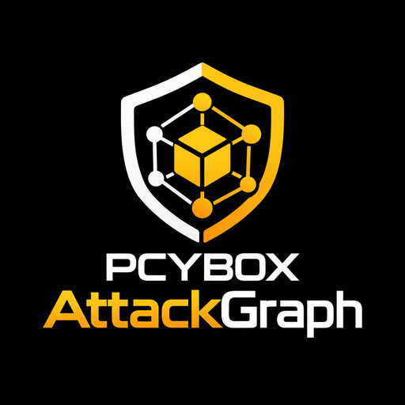
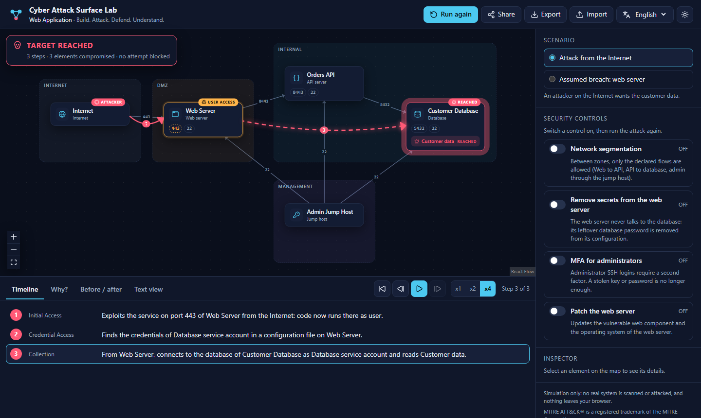
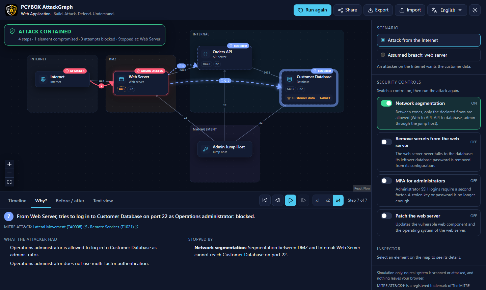

<p align="center">
  
</p>

# PCYBOX AttackGraph

> **Build. Attack. Defend. Understand.**

An open source lab that runs entirely in your browser: build a simulated infrastructure, **watch an attack move through it**, and **check whether your defense really works**. Every step comes with the reason it worked, and every control says exactly which precondition it breaks.

[Français](README.fr.md) · [Specification](docs/specification.fr.md) · [How the engine works](docs/engine.md) · [Lab format](docs/lab-format.md) · [Contributing](CONTRIBUTING.md)





## Why this project

Attack surface, lateral movement, segmentation, blast radius, defense in depth: these ideas are hard to grasp from static diagrams. PCYBOX AttackGraph turns them into something you can see and manipulate:

- **Visible**: the attack moves on the map, step by step, with replay controls.
- **Explainable**: the **Why?** panel lists the preconditions that held, the control that stopped a step, and the controls that *could* have stopped it, with one click to try them.
- **Causal**: the **Before / after** view compares your architecture with the same lab without any control.
- **Honest**: controls have no magic effect. MFA does not protect a service account; patching stops the entry but not an attacker already inside; a WAF (coming soon) stops injection but not every vulnerable component.
- **Accessible everywhere**: no account, no server, no tracking. Works on modest devices, in several languages, with a keyboard and a screen reader (the **Text view** is a full equivalent of the map).

**Simulation only.** The lab never scans, contacts or attacks a real system. Techniques are described at a conceptual level, mapped to [MITRE ATT&CK](https://attack.mitre.org/), without any exploitation procedure.

## Try it

The live demo will be published on GitHub Pages when the repository becomes public. Until then, run it locally:

```bash
git clone https://github.com/Mister-iks/pcybox-attackgraph.git
cd pcybox-attackgraph
pnpm install
pnpm dev
```

Then open the URL printed in the terminal, click **Run attack**, switch **Network segmentation** on, and run again.

Keyboard: `Space` plays or pauses, arrow keys step through the attack, `Home` goes back to the start.

## What is in v0.1

- The **Web Application** template: a public web server, an internal API, a customer database and an admin jump host, with two scenarios (attack from the Internet, assumed breach of the web server).
- A deterministic engine with 8 techniques and 4 controls (segmentation, secrets removal, MFA, patch).
- Animated map, timeline with x1/x2/x4 replay, **Why?** panel, **Before / after** comparison, **Text view**.
- Sharing by link (the whole lab travels in the URL fragment, nothing is stored on a server), export and import of `.attackgraph.json` files.
- English and French, light and dark themes, reduced motion support.

See the [roadmap](#roadmap) for what comes next.

## How it works

```text
lab (.attackgraph.json) ──▶ validation ──▶ engine (web worker) ──▶ story of events ──▶ map, timeline, Why?
```

The engine saturates the attacker's capabilities round by round (footholds, credentials, data access). Each technique has preconditions and effects; each control breaks a precise precondition. Because rounds are breadth first, the story replayed for a reached target is one of its shortest derivations. Details in [docs/engine.md](docs/engine.md).

## Repository layout

```text
apps/web/           web application (React, React Flow, Vite)
packages/engine/    simulation engine: pure TypeScript, no DOM, fully tested
packages/schema/    JSON Schema of the .attackgraph.json lab format
packages/i18n/      messages (English, French) shared by the app and the CLI
packages/cli/       attackgraph command line tool
content/templates/  ready-to-use labs (CC BY 4.0)
docs/               specification, engine and format documentation
```

## Development

Requirements: Node.js 20 or later and [pnpm](https://pnpm.io/).

```bash
pnpm install
pnpm dev             # start the app
pnpm test            # engine, schema and app unit tests
pnpm e2e             # end-to-end tests (Playwright, desktop and mobile)
pnpm verify          # everything the CI checks: text, types, tests, build, bundle budget
```

### Command line

```bash
pnpm attackgraph validate content/templates
pnpm attackgraph list content/templates/active-directory.attackgraph.json
pnpm attackgraph simulate content/templates/active-directory.attackgraph.json --scenario phishing --enable tiering
pnpm attackgraph compare content/templates/web-application.attackgraph.json --enable segmentation --lang fr
pnpm attackgraph simulate <lab> --format markdown   # or json, for other tools
```

Performance budget: at most 250 kB of initial JavaScript (gzip). The CI fails above it.

## Roadmap

| Version | Focus |
|---|---|
| **v0.1** (in progress) | One network, one attack, one defense: the Web Application template |
| v0.2 | Lab editor, 3 templates, Spanish and Brazilian Portuguese, command line tool |
| v0.3 | Attack paths, choke points, blast radius, embeddable view, offline PWA |
| v0.5 | Challenge mode, teacher mode, 10 missions aligned with NICE, ECSF and CyBOK |
| v1.0 | Stable format, 8 templates, 9 languages including Arabic and Chinese |

The complete plan is in the [specification](docs/specification.fr.md) (French).

## Contributing

Contributions are welcome: code, labs, translations, and reviews by security practitioners of the technique catalog. Start with [CONTRIBUTING.md](CONTRIBUTING.md). Please follow the [code of conduct](CODE_OF_CONDUCT.md), and report vulnerabilities as described in [SECURITY.md](SECURITY.md).

## License

- Code: [Apache License 2.0](LICENSE)
- Educational content (`content/`, `docs/`): [CC BY 4.0](LICENSE-CONTENT)

MITRE ATT&CK® is a registered trademark of The MITRE Corporation. This project is not affiliated with MITRE.
